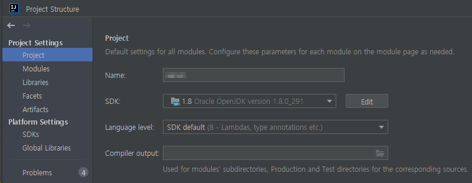
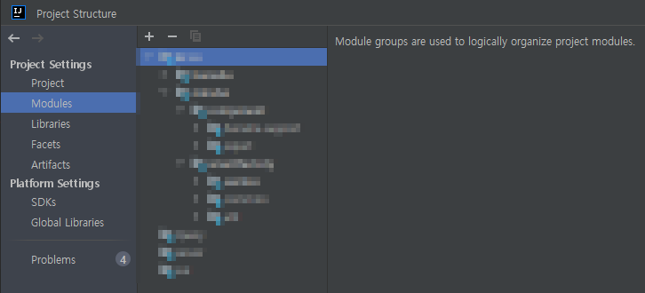
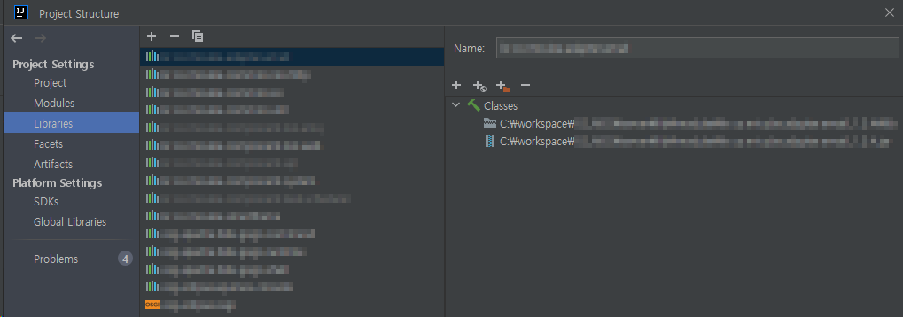
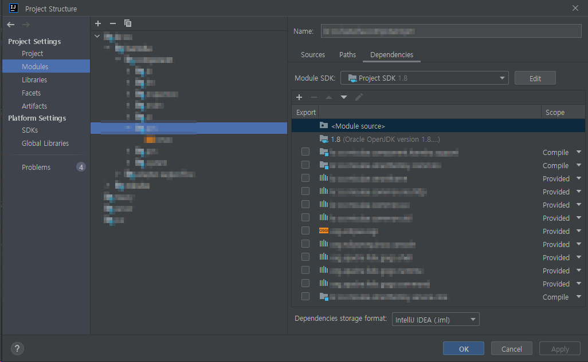
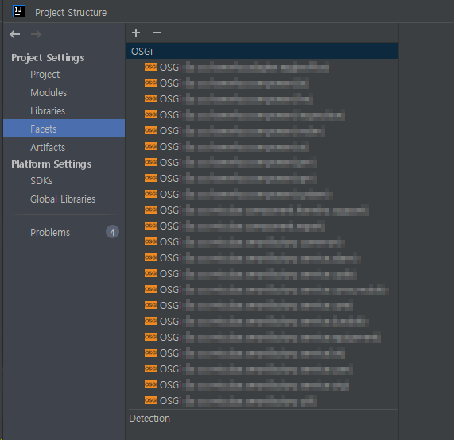
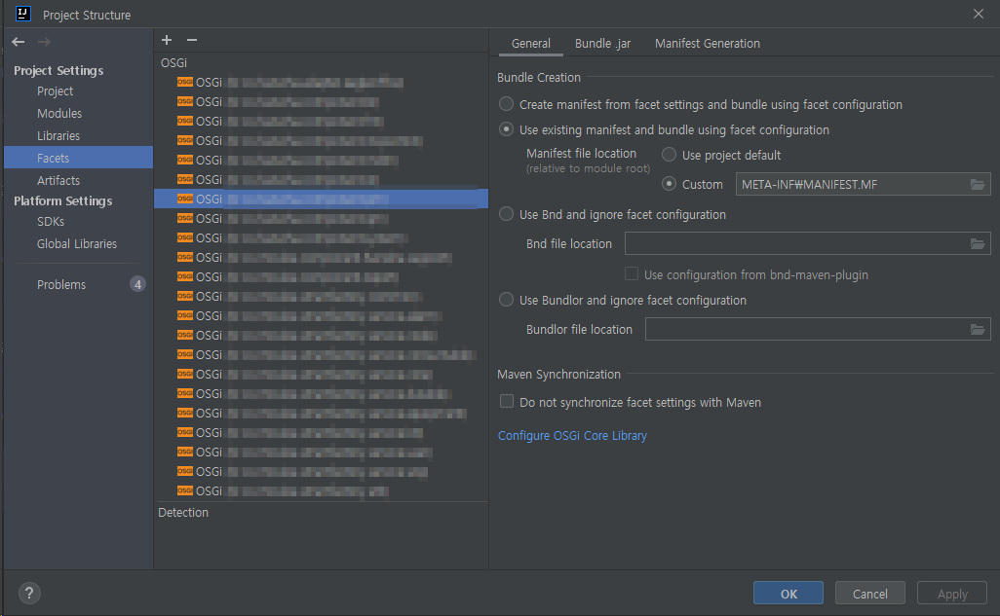
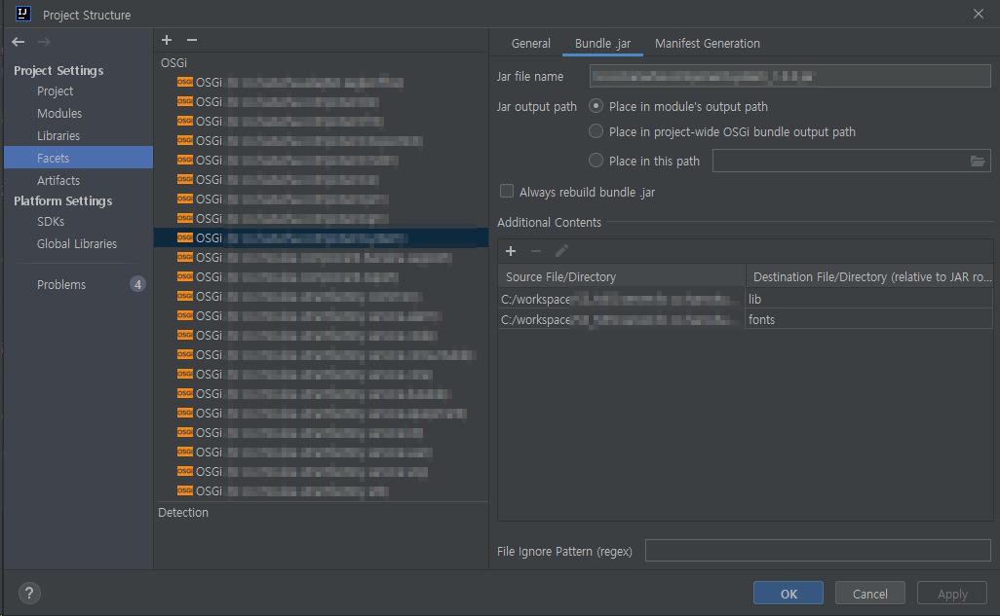
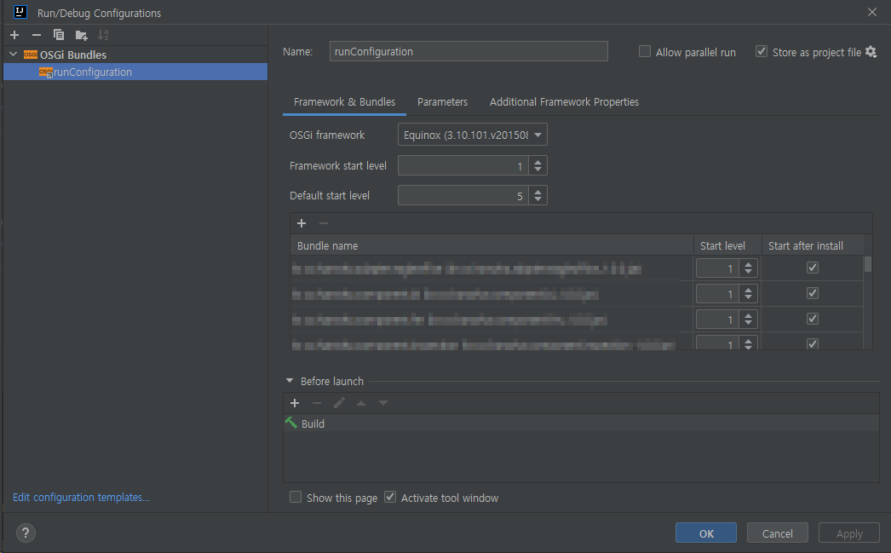

---
# Feel free to add content and custom Front Matter to this file.
# To modify the layout, see https://jekyllrb.com/docs/themes/#overriding-theme-defaults

# layout: home
layout: default
title: Intellij에서 OSGi 프로젝트 실행하기
parent: Java
grand_parent: 업무노트
nav_order: 1
---

# Intellij로 OSGi 프로젝트 실행하기


***
## 시작하기에 앞서
기존에 eclipse로 프로젝트를 돌리고 있었는데,
편하게 개발하려고 Intellij에서 OSGi 프로젝트를 돌려보기로 했다.
OSGi 프로젝트는 다뤄본 적이 처음이라 Intellij에 적용하기가 쉽지 않았다.

***
## 준비해야 할 것
- OSGi Project
- JDK
- Intellij
- OSGi Plugin
- OSGi Framework

***
## 1. Create Project
### New > Project
새로운 JAVA 프로젝트를 생성한다.
작업을 수행하면 깡통 프로젝트가 생성된다.
해당 프로젝트 경로에 프로젝트 소스를 위치시킨다.

단축키 : Ctrl + Alt + Shift + S > Project Settings > Project



***
## 2. Import Module
### New > Module from Existing Sources
프로젝트의 모듈 수 만큼 Import를 수행한다.
작업을 수행하면 프로젝트 하위에 모듈들이 Import 된다.

단축키 : Ctrl + Alt + Shift + S > Project Settings > Modules
경로 : .idea/modules.xml

#### 결과


***
## 3. Libraries
### Project Library
프로젝트 library를 설정한다.
이 프로젝트의 경우 *JAR 형태의 OSGi bundle*가 프로젝트 library로 설정이 필요했다.

단축키 : Ctrl + Alt + Shift + S > Project Settings > Libraries
경로 : .idea/libraries

프로젝트 library로 등록한 샘플 코드는 아래와 같다.
#### SAMPLE
```xml
<component name="libraryTable">
  <library name="jarmodule1">
    <CLASSES>
      <root url="jar://$PROJECT_DIR$/lib/module/jarmodule1.jar!/" />
    </CLASSES>
  </library>
</component>
```

다른 모듈에서 import 하면 모듈 iml 파일에 아래와 같이 코드가 생성된다.
#### SAMPLE
```xml
<module type="JAVA_MODULE" version="4">
  <component name="NewModuleRootManager">
    <orderEntry type="library" scope="PROVIDED" name="jarmodule1" level="project" />
  </component>
</module>
```

#### CAPTURE


***
## 4. Modules
### Sources
모듈 root 경로 및 source 폴더, binary 폴더, resource 폴더 등을 지정한다.

### Paths
모듈 Compliler Output 경로를 지정한다.

### Dependencies
모듈 dependency에는 필요한 *library JAR 및 OSGi bundle*을 dependency로 선언한다.

#### CAPTURE


***
## 5. Facets
### Add Module
모듈 Import 후 해당 모듈이 OSGi 모듈임을 설정한다.

단축키 : Ctrl + Alt + Shift + S > Project Settings > Facets

Add 버튼을 클릭하여 Import된 모듈을 OSGi 모듈로 설정한다.

#### CAPTURE


### General
Bundle Creation과 관련된 config를 설정한다.
eclipse에서 사용하던 *MANIFEST.MF* 파일이 있었기 때문에 그 파일을 manifest로 사용하였다.
(Use existing manifest and bundle using facet configuration)

#### CAPTURE


### Bundle.jar
Bundle 빌드 관련 설정한다.
- Jar file name : Jar file 명칭을 설정한다.
- Jar output path : Jar file 저장 경로를 설정한다.
- Additional Contents : Jar file에 포함할 Additional Contents를 설정한다.

#### CAPTURE


***
## 6. Run/Debug Configuration
### Add New Configuration
OSGi Bundles 선택하여 추가한다.

### Framework & Bundles
- OSGi framework : OSGi 버전을 선택한다. (사용하는 버전의 OSGi framework를 설치한다.)
- Select Bundles : Bundle을 선택하여 추가한다.
- Before launch : 실행 전 수행할 작업을 설정한다.

#### CAPTURE


### Parameters
VM options, Program parameters, Runtime directory 등을 설정한다.

***
## 마치며
외장 WAS를 사용하는 방식이 아니라 Intellij Community Edition 사용이 가능했고,
Intellij 에서 OSGi 프로젝트를 정상적으로 돌리기 까지 삽질도 많이 하고 시간이 걸렸지만
시간이 별로 아깝지 않다는 생각이 들 정도로 개발 환경이 쾌적해 진 것 같다.